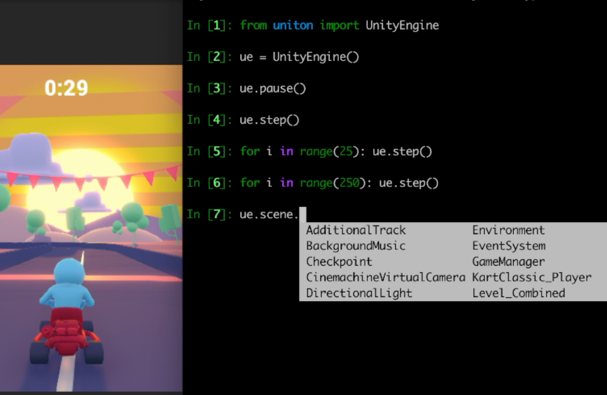
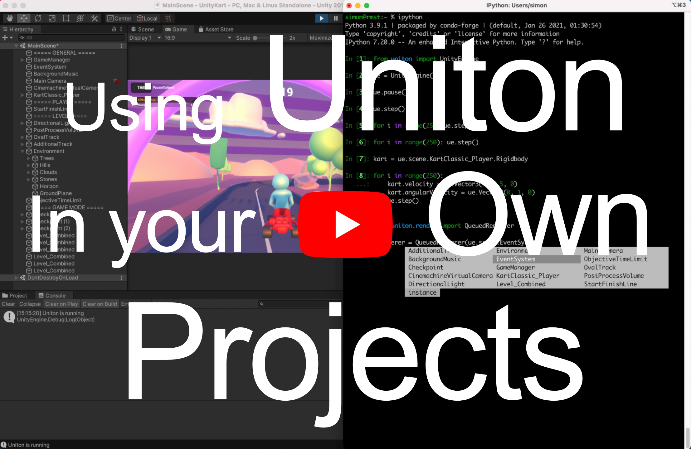

# Uniton – Control Unity From Python

[comment]: <> (Uniton is a framework to control the Unity game engine from Python. Here is a three-minute intro video:)

[comment]: <> ([![]&#40;./res/yt_thumbnail.png&#41;]&#40;https://www.youtube.com/watch?v=FIpt2yv623k&#41;)

<div style="width:100%">

<a href="https://www.youtube.com/watch?v=FIpt2yv623k"></a>
</div>
<br><br>

### Features

[comment]: <> (Edit the table below via https://www.tablesgenerator.com/markdown_tables)

|                                                                   	|                                          Uniton                                         	| Uniton Plus<br> [](https://github.com/sponsors/uniton-dev) 	| Uniton Pro<br>[](https://github.com/sponsors/uniton-dev) 	|
|-------------------------------------------------------------------	|:---------------------------------------------------------------------------------------:	|:------------------------------------------------------------------------------------------------------------------------------------------------------:	|:----------------------------------------------------------------------------------------------------------------------------------------------------:	|
| Interact live with all C# objects, functions, classes             	|                                            ☕️                                            	|                                                                            🔥                                                                           	|                                                                           💥                                                                          	|
| Full autocomplete and inspection for all C# objects (live coding) 	|                                            ☕️                                            	|                                                                            🔥                                                                           	|                                                                           💥                                                                          	|
| Fast, asynchronous execution                                      	|                                            ☕️                                            	|                                                                            🔥                                                                           	|                                                                           💥                                                                          	|
| Precise control over game time                                    	|                                            ☕️                                            	|                                                                            🔥                                                                           	|                                                                           💥                                                                          	|
| Faster-than-real-time rendering and simulation                    	|                                            ☕️                                            	|                                                                            🔥                                                                           	|                                                                           💥                                                                          	|
| No dependencies beyond Python and Unity                           	|                                            ☕️                                            	|                                                                            🔥                                                                           	|                                                                           💥                                                                          	|
| Build standalone applications that everyone can use               	|                                                                                         	|                                                                            🔥                                                                           	|                                                                           💥                                                                          	|
| Build apps in which everyone can import `.obj` and `.urdf` models 	|                                                                                         	|                                                                                                                                                        	|                                                                           💥                                                                          	|
| Install simply by dropping into your Unity Assets directory       	| 🤗<br>[`uniton.dll`](https://github.com/rmst/uniton/releases/latest/download/uniton.dll) 	|                      🔒<br>[`uniton_plus.dll`](https://github.com/uniton-dev/uniton-plus/releases/latest/download/uniton-plus.dll)                      	|                       🔒<br>[`uniton_pro.dll`](https://github.com/uniton-dev/uniton-pro/releases/latest/download/uniton-pro.dll)                      	|


### Usage
Install the Python package via
```bash
pip install uniton
```


To launch and connect to a Uniton app do
```python
import uniton
ue = uniton.UnityEngine(path='path/to/binary')

# Alternatively, to try out all features (including Pro) in a pre-built app do
ue = uniton.examples.KartGame()

# To try out all features (including Pro) in a higher fidelity scene do
ue = uniton.examples.Temple()
```

To connect to a Unity editor or to a running standalone app do
```python
ue = uniton.UnityEngine()

# Alternatively, to connect to remote Uniton app do, e.g.
ue = uniton.UnityEngine(host='192.168.1.101', port=10001)

# The remote Uniton app can been launched via, e.g. 'HOST="0.0.0.0" PORT=10001 path/to/binary'

```

#### Control time via
```python
ue.pause()  # this can block the whole window when used in the Unity editor
ue.step()  # advances game time by ue.time.delta and renders one frame
# more steps, etc..
ue.resume()  # resume real time operation
```

#### Access game objects via
```python
ue.scene.<gameobject>.<child_gameobject>

# Access components within game objects via
ue.scene.<gameobject>.<component>

# Transform attributes are directly available on the GameObject, e.g.
ue.scene.<gameobject>.position == ue.scene.<gameobject>.Transform.position
```

#### Access any C# class via
```python
ue.<namespace>.<classname>

# The 'UnityEngine' namespace can be omitted, i.e.
ue.<classname> == ue.UnityEngine.<classname>

# Instantiate any C# class by calling it, as is usual in Python, e.g.
v = ue.Vector3(0, 1, 0)
```

#### Receiving values from C#/Unity
```python
v.x  # returns a placeholder object for the 'x' property of a C# Vector3 object
v.x.py # immediately returns a promise object and triggers the value of 'v.x' to be sent to Python asynchronously
v.x.py() # blocks until the value has been received and returns the value

# Currently, only a few types can be received directly, e.g. int, float, str, byte arrays.
```

#### Rendering and receiveing frames
```python
from uniton import QueuedRenderer

renderer = QueuedRenderer(ue.scene.Main_Camera.Camera, width=512, height=256, render_steps=4, ipc_steps=3)
frame = renderer.render()  # will return a Numpy array of shape (256, 512, 3) and dtype 'uint8'
```

Internally, the frame is produced as follows.
```
Unity GPU (render) --render_queue--> Unity CPU --ipc_queue--> Python
```

Therefore, `frame` actually shows the state of the game a number of `renderer.render()`-calls earlier. To be precise, that number is

```python
renderer.delay() == render_steps + ipc_steps - 2
```

Consequently, the following will block and be slow but show the current state of the game.
```python
renderer = QueuedRenderer(ue.scene.Main_Camera.Camera, width=512, height=256, render_steps=1, ipc_steps=1)
frame = render.render()
```

### How does Uniton work?


### Limitations
- Generic C# classes and functions can't be used (please open an issue if this is important to you)
- Python functions can't be registered as C# callbacks (please open an issue if this is important to you)
- There is currently no documentation beyond this readme 


###License
Uniton is currently only partially open-source (https://pypi.org/project/uniton/). I might open-source all of it eventually. In the meantime, if you need access to the source code, please contact me at simonramstedt+uniton@gmail.com. At least the base version of Uniton will always be free. 

