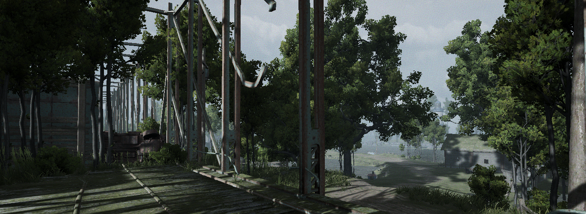
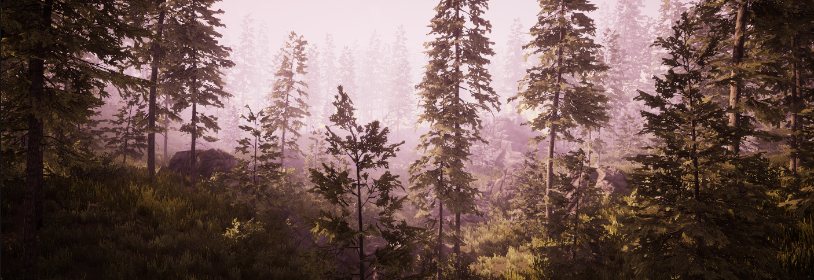
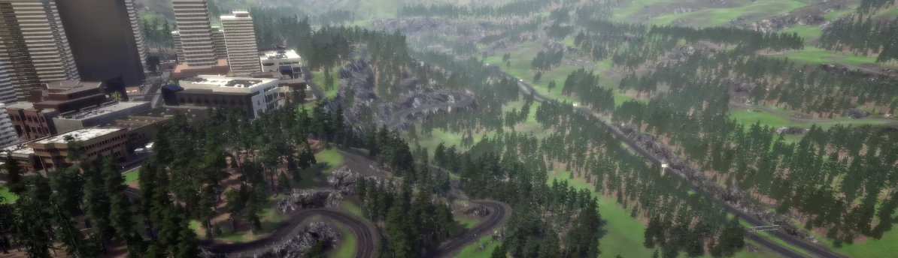

# Example Environments

Uniton comes with pre-built example environments that automatically download when they are first used. All examples (except 'Empty' and 'Kart') come with a fly cam, which lets you move in 3D and explore the environment with the mouse and WASD-keys.


## Empty Scene
An empty scene - 50 MB
```python
import uniton
ue = uniton.examples.Empty()
```
To modify and compile the scene yourself create an empty project and drop in the `uniton.dll`.


## Kart ([Demo Video](https://www.youtube.com/watch?v=7BHYa1Ycb-A))
The kart game from the Uniton demo video – 100 MB
```python
import uniton
ue = uniton.examples.Kart()
```
To modify and compile the scene yourself follow the instructions in the video.


## Temple ([Demo Video](https://www.youtube.com/watch?v=Y9R2vkMJCDM))

A large and detailed Temple scene – 300 MB
```python
import uniton
ue = uniton.examples.Temple()
```
To modify and compile the scene yourself you can download it for free from the Asset Store [here](https://assetstore.unity.com/packages/3d/environments/sun-temple-115417).


## Flooded Grounds ([Demo Video](https://youtu.be/zp7g1VFo_74?t=190))

A large outdoor scene – 500 MB
```python
import uniton
ue = uniton.examples.FloodedGrounds()
```
To modify and compile the scene yourself you can download it for free from the Asset Store [here](https://assetstore.unity.com/packages/3d/environments/flooded-grounds-48529).


## Forest ([Video](https://www.youtube.com/watch?v=PELoyIT437Y))

A small but high-fidelity forest scene – 300 MB
```python
import uniton
ue = uniton.examples.Forest()
```
To modify and compile the scene yourself you can download it from the description in the video.


## Windridge City ([Demo Video](https://www.youtube.com/watch?v=qo9vr7GetTA))

A scene containing a mini city surrounded trees and mountains – 500 MB
```python
import uniton
ue = uniton.examples.WindridgeCity()
```
To modify and compile the scene yourself you can download it for free from the Asset Store [here](https://assetstore.unity.com/packages/3d/environments/roadways/windridge-city-132222).